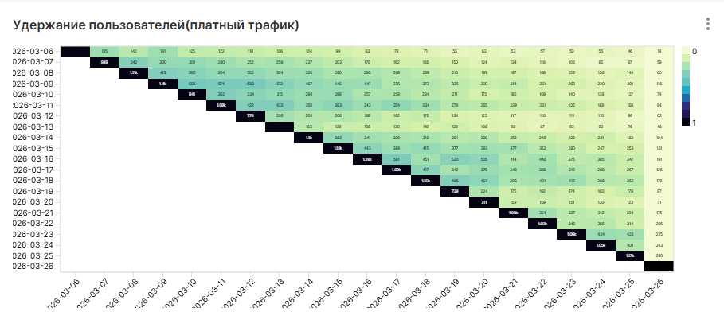
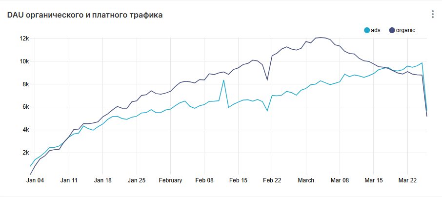
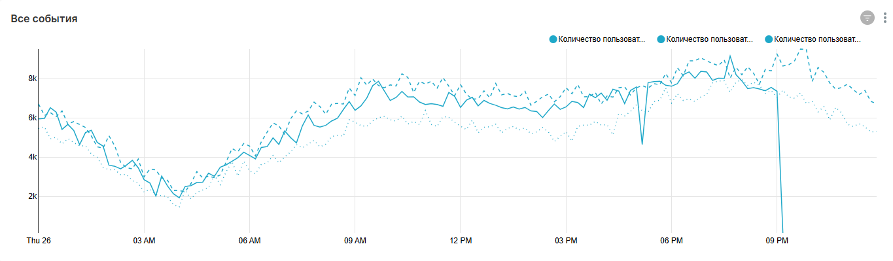

# 📊 Анализ пользовательской активности и продуктовые дашборды

## 📌 Описание проекта

В рамках проекта разработаны дашборды для анализа пользовательской активности, ключевых продуктовых метрик и взаимодействия сервисов (лента новостей и мессенджер).

Цель — понять поведение пользователей, оценить источники трафика и выявить точки роста продукта.

---

## 🎯 Задачи

- Рассчитать ключевые продуктовые метрики (DAU, CTR, retention)
- Проанализировать источники трафика (ads / organic)
- Изучить поведение пользователей во времени
- Оценить взаимодействие пользователей с разными сервисами
- Выявить различия в качестве аудитории

---

## 🛠 Стек

- SQL (ClickHouse)
- Apache Superset / Redash

---

## 📊 Дашборды и метрики

### DAU (Daily Active Users)

---

### CTR (Click-Through Rate)

---

### Retention (удержание пользователей)

---

### Источники трафика (ads vs organic)

---

### Активность пользователей по времени

---

## 🔍 Основные выводы

- DAU демонстрирует рост, однако динамика неравномерная и содержит резкие изменения  
- Пользователи из рекламных источников увеличивают трафик, но уступают органике по качеству  
- Retention значительно различается между сегментами пользователей  
- Значительная часть аудитории взаимодействует только с лентой и не использует другие сервисы  
- Активность пользователей имеет выраженные пики в течение дня  

---

## 💡 Рекомендации

- Оптимизировать рекламные каналы с учётом качества аудитории  
- Развивать сценарии вовлечения пользователей в дополнительные сервисы  
- Проанализировать контент с высоким CTR и масштабировать успешные практики  
- Учитывать пики активности при планировании продуктовых изменений  

---

## 📁 SQL-запросы

В папке `sql/` представлены основные запросы для расчёта метрик:

- `dau.sql` — расчёт ежедневной активной аудитории  
- `ctr.sql` — расчёт CTR  
- `sources.sql` — анализ источников трафика  
- `activity_by_hour.sql` — активность пользователей по времени  
- `retention_ads.sql` — когортный анализ retention  

---

## 📌 Данные

Использованы данные пользовательских действий (просмотры, лайки, сообщения) из симулятора.

---